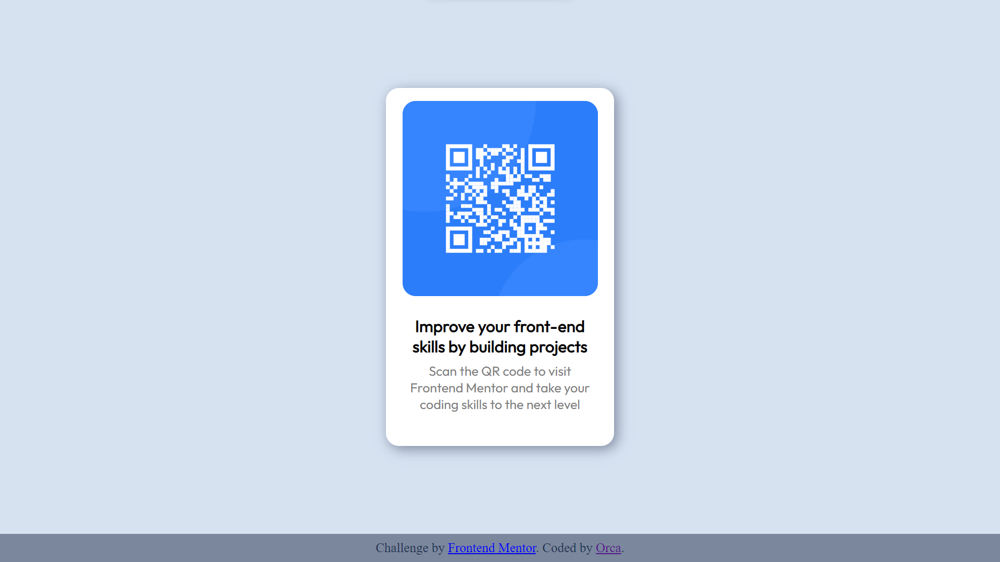

# Frontend Mentor - QR code component solution

This is a solution to the [QR code component challenge on Frontend Mentor](https://www.frontendmentor.io/challenges/qr-code-component-iux_sIO_H). Frontend Mentor challenges help you improve your coding skills by building realistic projects. 

## Table of contents

- [Overview](#overview)
  - [Screenshot](#screenshot)
  - [Links](#links)
- [My process](#my-process)
  - [Built with](#built-with)
  - [What I learned](#what-i-learned)
  - [Continued development](#continued-development)
  - [Useful resources](#useful-resources)
- [Author](#author)

## Overview
- Hey People!
  -This Is QR Code Challenge by Front-End Mentor, In this Challenge we have to make a website as shown below using HTML and CSS.
  -It is a super easy challenge for newbie's. You have a lotta fun doing these challenges and learn lot of new things few of them are mentioned below.
### Screenshot

### Links

- Solution URL: [GitHub Solution Link](https://github.com/yup-itsOrca/QR-code-challenge)
- Live Site URL: [QR Code Challenge](https://yup-itsorca.github.io/QR-code-challenge/)

## My process

-First, I downloaded the required sources like images etc from the Front-End-Mentor Website.
-Secondly, I created a html file named "index.html".
-Create a basic structure of the website using html.
-Added some css to make it more attractive like background color, aligning the text the images etc.
-Created a repository in github and pushed all the required files from the local(my laptop) system to remote(github) system using git.
-Git Pages helped me with making my site go live.

### Built with

- Semantic HTML5 markup
- CSS custom properties
- Flexbox

### What I learned

Few new terms like div, class, Id, footer etc
I learned how to use Flexbox to manage multiple containers and it's properties are so easy to understand and implement.
I learned about Box Shadow and how to implement it

### Continued development

-To create the same website using CSS Grid.
-To make the website reponsive.
-To add few fun elements to the website like a hover effect.

### Useful resources

- [CodeWithHarry](https://www.youtube.com/watch?v=5qVuORLniwM) - This video really helped me with Flexbox and how to use flexbox.

- [ColorCodeio](https://www.youtube.com/shorts/uc4ClUmTYVM) - This is an amazing 1 min video which helped me finally understand Box-Shadow. I'd recommend it to anyone still learning this concept.

## Author

- I don't have portfolio at the moment :/
- Frontend Mentor - [@yup-itsOrca](https://www.frontendmentor.io/profile/yup-itsOrca)