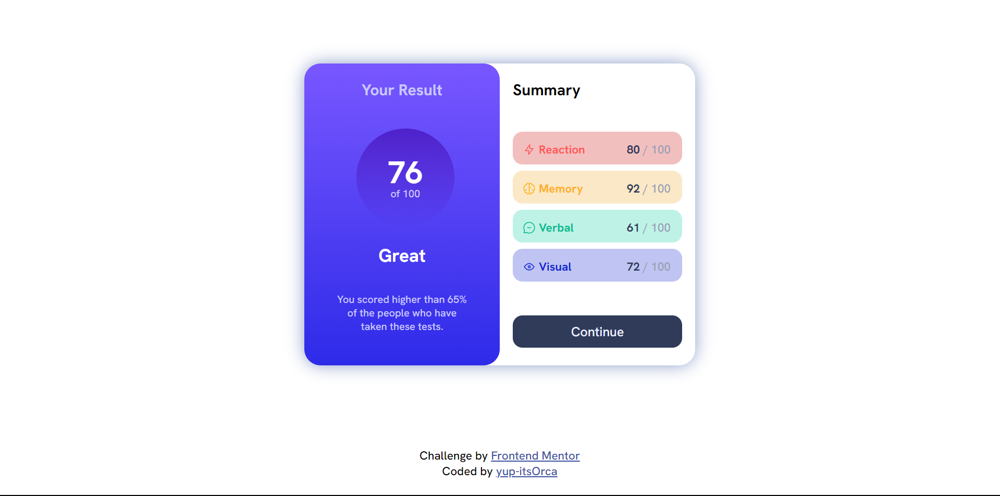

# Frontend Mentor - Results summary component solution

This is a solution to the [Results summary component challenge on Frontend Mentor](https://www.frontendmentor.io/challenges/results-summary-component-CE_K6s0maV). Frontend Mentor challenges help you improve your coding skills by building realistic projects. 

## Table of contents

- [Overview](#overview)
  - [The challenge](#the-challenge)
  - [Screenshot](#screenshot)
  - [Links](#links)
  - [Built with](#built-with)
  - [What I learned](#what-i-learned)
  - [Continued development](#continued-development)
  - [Useful resources](#useful-resources)
- [Author](#author)

## Overview
Hi, fellas!
+ This Project is on Front End Mentor Challenge i.e ###### _Result Summary Component_
  Level: Newbie, Using HTML and CSS

+ ##### Tools used
  - HTML5
  - CSS 
  - Git and Gtihub (To Push and Host this Project)

### The challenge

Users should be able to:

- View the optimal layout for the interface depending on their device's screen size
- See hover and focus states for all interactive elements on the page

### Screenshot

### Links

- Solution URL: [Github Solution URL is Right here](https://github.com/yup-itsOrca/Result-Summary)
- Live Site URL: [Live site URL here](https://yup-itsorca.github.io/Result-Summary/)

### Built with

- Semantic HTML5 markup
- CSS custom properties
- Flexbox
- CSS Grid
- Media Queries

### What I learned

+ I got to know about CSS Grid which is much reliable than other CSS properties.
+ About CSS Hover, We can change the properties of an element when the cursor is placed above it using CSS Hover Example <tag-name>hover:{ background-color: blue }
+ You we can use Linear Gradient Property in CSS to use multiple colours on the same     element. It super fun and Easy to learn, for example: If you Hover the Continue button you can observe we have used to colors on it.

### Continued development

+ to implement js on it and make it responsive and change values
+ to make the code much clean.

### Useful resources

- [Linear Gradient](https://www.w3schools.com/css/css3_gradients.asp) - This is an amazing article which helped me finally understand Linear Gradient n More. I'd recommend it to anyone still learning this concept.

## Author

- Website - I don't have my own portfolio at the moment! Sorry
- Frontend Mentor - [@yup-itsOrca](https://www.frontendmentor.io/profile/yup-itsOrca)
- Twitter - [@CodeWithOrca](https://www.twitter.com/codewithorca)